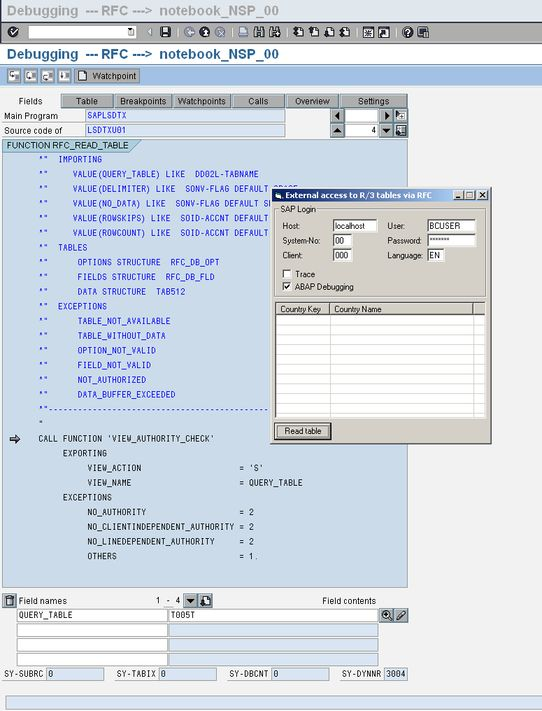



## CLibRfc32 \- Calling SAP R/3 function modules from VB

### Description

This is a class to encapsulate the functions of the SAP Remote Function Call Library (librfc32).

The class can be used to call SAP R/3 function modules from a Visual Basic application.

It supports IMPORT parameters, EXPORT parameters, TABLES and receives EXCEPTIONS.

Allocating and freeing memory is completely encapsulated.

The example application shows how to read the countries from table T005T with the standard function module RFC_READ_TABLE.

The class depends on the Remote Function Call Library (librfc32.dll) from SAP.

Tested on SAP Netweaver 7.0 (2004s) and SAP Netweaver 6.4 (2004).

This is the first Rfc-example on PSC.
 
### More Info
 

             |
---                |---
**Submitted On**   |2008-01-27 20:20:34
**By**             |[swapp](https://github.com/Planet-Source-Code/PSCIndex/blob/master/ByAuthor/swapp.md)
**Level**          |Advanced
**User Rating**    |5.0 (15 globes from 3 users)
**Compatibility**  |VB 5\.0, VB 6\.0
**Category**       |[Miscellaneous](https://github.com/Planet-Source-Code/PSCIndex/blob/master/ByCategory/miscellaneous__1-1.md)
**World**          |[Visual Basic](https://github.com/Planet-Source-Code/PSCIndex/blob/master/ByWorld/visual-basic.md)
**Archive File**   |[CLibRfc32\_2099421272008\.zip](https://github.com/Planet-Source-Code/swapp-clibrfc32-calling-sap-r-3-function-modules-from-vb__1-69996/archive/master.zip)

